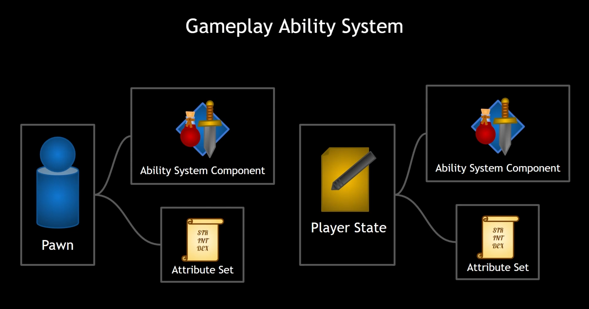
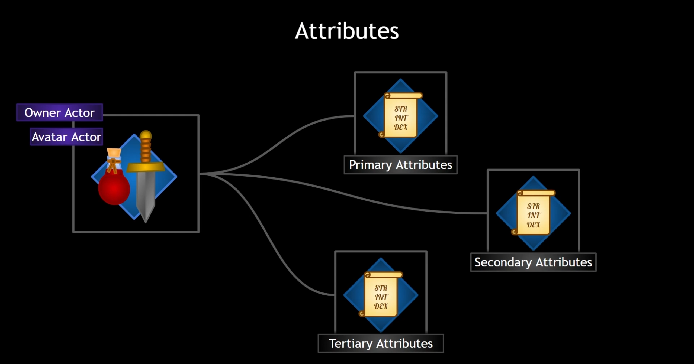

# UE5_GameplayAbilitySystem_Aura

> Online repo for Gameplay Ability System


# 第1节：项目创建

1. 	在多人游戏中，复制的本质是当服务器上的实体发生变化时，服务器上发生的更改会复制或发送到它连接的所有客户端上。
    > 多人网络这块不熟悉的建议把官方文档上的这一模块看完：👉[Networking and Multiplayer](https://dev.epicgames.com/documentation/en-us/unreal-engine/networking-and-multiplayer-in-unreal-engine)

>

2. 	(1) 对于C++中的指针，我们可以使用 **check** 代替 if 判断是否有效，如果这是调试模式这会触发断点，如果你希望 false 时发生崩溃可以这样做；
	(2) 对于转换我们也可以使用 CastChecked 代替 Cast，会比 Cast 多个断言；
    (3) Cast 如果转换失败会返回 nullptr；
    (4) **checkf** 如果判断失败会比 check 多打印字符到日志中；

>

3. 	创建动画蓝图时，可以选择创建 Specific Skeleton 和 Template，如果想做成通用的可以试试创建一个 Template，创建一个动画蓝图模板，继承该动画蓝图会同样继承 Event Graph 和 Anim Graph；

>

4. 	(1) 可以在 Character 和 Controller 中绑定和实现移动逻辑，不过比较推荐在 Controller 中写，
        这样让 Controller 分担一些逻辑更方便维护，而不是所有逻辑全写在 Character 里面；
	(2) 然后一些功能相关的逻辑推荐写到组件里面，这样方便复用以及维护；

>

5. 	使用接口的好处
	例如：
    在这个 Top-Down 游戏中，我们希望玩家可以使用鼠标点击敌人让敌人产生高亮轮廓，
    UPlayerController 可以获取光标下面的 AActor，但我们不想将逻辑写在 UPlayerController 中，
    我们可以创建一个高亮显示用的接口，让敌人实现高亮显示的函数，不同的敌人可以以不同的方式实现高亮函数，
    这样 UPlayerController 就不用管怎么实现了，交给实现了接口的 AActor 即可；
    > 我们还可以将这个接口添加到桶或门上，并以不同的方式突出显示这些对象

>

6. 	将成员变量保存到接口的正确做法是使用 TScriptInterface<> 而不是直接使用 IxxxInterface*
	参考文档：👉[Unreal Interfaces](https://dev.epicgames.com/documentation/en-us/unreal-engine/interfaces-in-unreal-engine)
	> 看这个模块Safely Store Object and Interface Pointers

	使用这个的好处：
	(1) 安全
	(2) 方便，TScriptInterface 内置了构造函数和操作符重载，比如可以省去 Cast 转换用来判断是否实现了接口：
    ```cpp
    TScriptInterface<IEnemyInterface> LastActor;
    TScriptInterface<IEnemyInterface> ThisActor;
    LastActor = ThisActor;
    ThisActor = CursorHit.GetActor();
    ```

>

7.  使用自定义深度注意有没有设置 ProjectSettings/Rendering->CustomDepth-StencilPass 为 Enabled with Stencil，默认 Enabled 是禁用 Stencil 的；
    不熟悉高亮材质制作思路的可以了解下 Content/Assets/Materials/PP_Highlight

# 第2节：介绍GAS系统 (Gameplay Ability System)

官方文档：👉[Gameplay Ability System](https://dev.epicgames.com/documentation/en-us/unreal-engine/gameplay-ability-system-for-unreal-engine)

这里列出目录，如果不太熟悉，建议先熟悉下官方文档介绍的 GAS

- **Ability System Component And Attributes**
  > Using the Ability System Component with Gameplay Attributes and Attribute Sets
- **Gameplay Ability**
  > Overview of the Gameplay Ability class.
- **Gameplay Attributes and Attribute Sets**
- **Gameplay Ability System Overview**
  > The Gameplay Ability System is a framework for building abilities and interactions that Actors can own and trigger. This system is designed mainly for RPGs, action-adventure games, MOBAs, and other types of games where characters have abilities that need to coordinate mechanics, visual effects, animations, sounds, and data-driven elements, although it can be adapted to a wide variety of projects. The Gameplay Ability System also supports replication for multiplayer games, and can save developers a lot of time scaling up their designs to support multiplayer.
  With this system, you can create abilities as simple as a single attack, or as complex as a spell that triggers many status effects depending on data from the user and the targets. This page provides an overview of the Ability System and how its components work together.
  > 什么是游戏能力？
  > 游戏能力是演员可以拥有并重复触发的游戏内动作。常见的例子包括法术、特殊攻击或物品触发的效果。
  > 虚幻引擎的游戏能力系统的设计涉及三个主要考虑因素:
  > - **追踪能力的拥有者**
  > - **跟踪能力状态**：
        1. 当能力被激活时；
        2. 当前正在进行该能力的执行时；
        3. 当能力完全完成并且不再有效时；
  > - **协调能力的执行** (Coordinating an Ability's Execution)：
        一种能力必须能够在执行过程中以特定的时间与多个不同的系统进行交互。这些交互可以是您在 Blueprint 中可以执行的任何操作，包括：
        - 激活动画蒙太奇；
        - 暂时控制角色的移动；
        - 触发视觉效果；
        - 执行重叠或碰撞事件；
        - 取消正在进行中的其他能力；
        - 等等...
        根据能力的工作方式，它可以在处于活动状态时在许多不同的时间点执行这些交互中的任何一个，包括在动画中间，并且某些效果可能需要在能力本身完成后持续存在。
  
  > 在多人游戏中，能力系统组件还负责将信息复制到客户端、将玩家操作传达到服务器以及验证客户端是否有权更改能力系统组件的状态。能力系统组件的父 Actor 必须由本地控制的玩家拥有才能进行远程激活，这意味着您只能对您控制的 Actor 执行能力。
  
  > - 您可以通过四种主要方法激活游戏能力：
      1. 您可以使用游戏能力句柄通过蓝图或 C++ 代码显式激活能力。这是在授予能力时由能力系统组件提供的；
      2. 使用游戏事件。这会通过匹配的能力触发器触发所有能力。如果您需要抽象输入和决策机制，则此方法更可取，因为它提供了最大程度的灵活性；
      3. 使用带有匹配标签的游戏​​效果。这会通过匹配的能力触发器触发所有能力。这是触发游戏效果能力的首选方法。一个典型的用例是睡眠减益，它会触发播放禁用动画并抑制其他游戏操作的能力；
      4. 使用输入代码。这些被添加到能力系统组件中，当被调用时它们将触发所有匹配的能力。其功能与游戏事件类似；
  
  > 当您激活游戏能力时，系统会将该能力识别为正在进行中。然后，它会触发附加到 Activate 事件的任何代码，遍历每个函数和游戏任务，直到您调用EndAbility函数来表示该能力已完成执行。如果需要进行任何额外的清理，您可以将更多代码附加到OnRemove事件。您还可以取消在执行过程中停止它的能力。 GameplayAbility 中的大多数函数在AbilitySystemComponent 中都有对应的函数，因此您可以为每个GameplayAbility 或每个AbilitySystemComponent 类选择不同的功能。
  
  > 游戏能力使用游戏标签来限制执行。所有能力都有一个在激活时添加到其所属 Actor 上的标签列表，以及阻止激活或自动取消该能力的标签列表。虽然您可以使用自己的代码手动取消、阻止或允许能力的执行，但这提供了一种系统一致的方法。

  > - **Attribute Sets and Attributes**
  > - **Handling Gameplay Effects**
      **游戏提示是负责运行视觉和声音效果的 Actor 和 UObject**，是在多人游戏中复制装饰反馈的首选方法。**游戏提示不使用可靠的复制**，因此，游戏提示应仅用于装饰性反馈。对于需要复制到所有客户端的游戏相关反馈，您应该依靠能力任务来处理复制。播放蒙太奇能力任务就是一个很好的例子。
  > - 网络游戏中的大部分能力都需要在服务器上运行并复制到客户端，因此能力激活通常会存在滞后。这在大多数快节奏的多人游戏中是不可取的。为了掩盖这种延迟，您可以在本地激活一项能力，然后告诉服务器您已激活它，以便它可以赶上。

  > 更多资料请阅读：👉[Gameplay Ability System Overview](https://dev.epicgames.com/documentation/en-us/unreal-engine/understanding-the-unreal-engine-gameplay-ability-system)
- **Gameplay Effects**
  > 游戏能力系统使用游戏效果来更改游戏能力所针对的 Actor 的属性。游戏效果由可应用于 Actor 属性的函数库组成。这些可以是即时效果，例如施加伤害，也可以是持久效果，例如随着时间的推移对角色造成伤害的毒药。
  游戏效果是资产，因此在运行时是不可变的。
  存在一些例外情况，例如游戏效果在运行时创建，但数据一旦创建和配置就不会被修改。
  **游戏效果生命周期**
  游戏效果的持续时间可以设置为Instant 、 Infinite或Has Duration 。
  > - 游戏效果组件 (Gameplay Effect Components)
- **Ability Tasks**




可以将这些保留在 Pawn 或者 PlayerState 上

1. 如果是敌人 AI，这些敌人不需要 PlayerState，因为它们很简单，可以选择添加在 Pawn 上；
2. 如果是玩家，考虑到 Pawn 会销毁重生，如果你没有在 SaveGame 中保存这些数据，那么添加在 PlayerState 上是一个好的选择，还有一些原因，比如你不想让你的玩家类变得混乱，或者你不想只作用于特定的某一个角色，想更通用一点；

**在这个项目中，我们的敌人角色将直接拥有他们的能力、系统组件和属性集，但是对于我们的玩家控制的角色，我们将把我们的能力系统组件和属性；**


使用前需要启用插件


## GAS In Multiplayer


## Remarks

1. 在 PlayerState 构造函数中设置，服务器尝试更新客户端的频率（每秒更新多少次），我们可以设置得更快一些，比如可以设置 100.0f 左右：
   ```cpp
   NetUpdateFrequency = 100.0f;
   ```

2. 为 AbilitySystemComponent 设置复制模式
   
   ```cpp
   // Example
   UAbilitySystemComponent::SetReplicationMode(EGameplayEffectReplicationMode::Mixed);
   ```

   

3. 初始化 ASC 的 Owner Actor 和 Avator Actor
   
   

   

4. 对于混合复制（Mixed）模式：OwnerActor 的 Owner 必须是 Controller。对于 pawn，这是在 posssedby() 中自动设置的；
   PlayerState 的所有者被自动设置为 Controller；
   因此，如果你的 OwnerActor 不是 PlayerState，并且你使用混合复制模式，你必须在 OwnerActor 上调用 SetOwner() 来将其所有者设置为 Controller；
   
   > 默认情况下。PlayerState 的所有者会自动设置为 Controller，因此我们实际上不需要执行任何操作。

# 第3节：属性 (Atrributes)

1. 在构造函数中，当我们在 AbilitySystemComponent 旁边构建 AttributeSet 时，它会自动注册到 AbilitySystemComponent 中。AbilitySystemComponent 可以访问它以及注册的任何其他 AttributeSet；
   
   

   > 同一 UAttributeSet 类型不能有多个属性集，否则，尝试从 AbilitySystemComponent 检索时会有歧义；
   > 将所有属性包含在同一属性上是完全可以接受的（在这个项目中就是这样）

   

2. **属性是与游戏中给定实体（例如角色）相关的数值，所有属性都是浮点数**，他们存在于称为 **FGameplayAttributeData** 的结构体中（包含两个 float 值，官方建议使用），属性存储在属性集上，属性集对其进行密切监督；我们可以知道属性何时发生变化，并使用我们喜欢的任何功能来影响它；
   现在可以直接在代码中设置属性值，但更改它的首选方法是应用 **游戏效果 (Gameplay Effects)**；

   Gameplay Effects 还帮我们做了预测，这可以让我们的多人游戏体验更加流畅：

   

3. 通过 **GAS 预测**，Gameplay Effects 会修改客户端的属性，并且在客户端上可以立即感知到该变化，无滞后时间；
   然后，该更改将发送到服务器，服务器仍然负责验证该更改。如果服务器认为这是有效的更改，那就酷了。它可以将更改通知其他客户端。但是，如果服务器确定更改无效，假设客户端破解了游戏，例如，尝试造成不合常理的损害，那么服务器可以拒绝该更改并回滚到正确的值。所以服务器仍然有权限，但是我们的客户端不必有延迟。预测很复杂，将其作为整个 GAS 的内置功能是一个巨大的好处。让我们专注于创建游戏机制，而不用担心实施滞后补偿。

   

4. 属性实际上由两个值组成：基值（Base Value）和当前值（Current Value），基值是属性的永久值。当前值是基础值加上游戏效果（Gameplay Effects）造成的任何临时的修改。
   
   

5. 在多人游戏中，我们会将属性设置为 Replicated，我们也知道，游戏效果会自动帮我们做预测的工作；
   **对于属性，我们需要使用代表通知（RepNotify），请记住，当变量被复制时，RepNotify 会自动被调用，因此当服务器复制时，将变量发送给客户端，客户端会触发该变量的 RepNotify（注意 RepNotify 必须是 UFUNCTION）**；

   > 代表通知可以接受0个或者1个参数，如果它们接受一个参数（只能是对应的复制变量，可以是 const 和 &），当被调用时会传入对应复制变量的旧值（这对于比较新旧值很有用）

    ```cpp
    UCLASS()
    class AURA_API UAuraAttributeSet : public UAttributeSet
    {
        GENERATED_BODY()
        
    public:
        UAuraAttributeSet();
        virtual void GetLifetimeReplicatedProps(TArray<FLifetimeProperty>& OutLifetimeProps) const;

        UPROPERTY(BlueprintReadOnly, ReplicatedUsing = OnRep_Health, Category = "Vital Attributes")
        FGameplayAttributeData Health;

        UPROPERTY(BlueprintReadOnly, ReplicatedUsing = OnRep_MaxHealth, Category = "Vital Attributes")
        FGameplayAttributeData MaxHealth;

        UFUNCTION()
        void OnRep_Health(const FGameplayAttributeData& OldHealth) const;

        UFUNCTION()
        void OnRep_MaxHealth(const FGameplayAttributeData& OldMaxHealth) const;
    };
    ```

    GAMEPLAYATTRIBUTE_REPNOTIFY(ClassName, PropertyName, OldValue)

    ```cpp
    UAuraAttributeSet::UAuraAttributeSet()
    {
    }

    void UAuraAttributeSet::GetLifetimeReplicatedProps(TArray<FLifetimeProperty>& OutLifetimeProps) const
    {
        Super::GetLifetimeReplicatedProps(OutLifetimeProps);

        /**
        * REPNOTIFY_OnChanged 是当变量值改变时才复制
        * 对于 GAS，我们无论如何都想复制它，因为如果我们设置它，我们可能想要响应设置它的行为。
        * 无论我们将其设置为新值还是其自身的相同值，您都可能想要响应，即使它的数值没有改变。
        * 因此这里我们使用 REPNOTIFY_Always
        */
        DOREPLIFETIME_CONDITION_NOTIFY(UAuraAttributeSet, Health, COND_None, REPNOTIFY_Always);
        DOREPLIFETIME_CONDITION_NOTIFY(UAuraAttributeSet, MaxHealth, COND_None, REPNOTIFY_Always);
    }

    void UAuraAttributeSet::OnRep_Health(const FGameplayAttributeData& OldHealth) const
    {
        // 负责通知 AbilitySystemComponent 属性被复制了，并跟踪旧值，以防万一需要回滚任何内容
        GAMEPLAYATTRIBUTE_REPNOTIFY(UAuraAttributeSet, Health, OldHealth);
    }

    void UAuraAttributeSet::OnRep_MaxHealth(const FGameplayAttributeData& OldMaxHealth) const
    {
        GAMEPLAYATTRIBUTE_REPNOTIFY(UAuraAttributeSet, MaxHealth, OldMaxHealth);
    }
    ```

6. 设置一些访问器函数来检索和设置我们属性集中的属性，即使我们通常不从代码中设置它们（一般直接使用 Gameplay Effects），但可以了解一下如何使用，我们可以使用引擎内置的宏，也可以自己创建：
    
    ```cpp
    /**
    * This defines a set of helper functions for accessing and initializing attributes, to avoid having to manually write these functions.
    * It would creates the following functions, for attribute Health
    *
    *	static FGameplayAttribute UMyHealthSet::GetHealthAttribute();
    *	FORCEINLINE float UMyHealthSet::GetHealth() const;
    *	FORCEINLINE void UMyHealthSet::SetHealth(float NewVal);
    *	FORCEINLINE void UMyHealthSet::InitHealth(float NewVal);
    *
    * To use this in your game you can define something like this, and then add game-specific functions as necessary:
    * 
    *	#define ATTRIBUTE_ACCESSORS(ClassName, PropertyName) \
    *	GAMEPLAYATTRIBUTE_PROPERTY_GETTER(ClassName, PropertyName) \
    *	GAMEPLAYATTRIBUTE_VALUE_GETTER(PropertyName) \
    *	GAMEPLAYATTRIBUTE_VALUE_SETTER(PropertyName) \
    *	GAMEPLAYATTRIBUTE_VALUE_INITTER(PropertyName)
    * 
    *	ATTRIBUTE_ACCESSORS(UMyHealthSet, Health)
    */
    ```

    不必理解宏是怎么做到的，这就是宏创造的魔法（有能力了后面再看懂也没事，现在看注释知道如何使用即可）

    可以在你的属性集中定义下面的宏，它帮我们创建了很多有用的访问器函数：
    ```cpp
    #define ATTRIBUTE_ACCESSORS(ClassName, PropertyName) \
        GAMEPLAYATTRIBUTE_PROPERTY_GETTER(ClassName, PropertyName) \
        GAMEPLAYATTRIBUTE_VALUE_GETTER(PropertyName) \
        GAMEPLAYATTRIBUTE_VALUE_SETTER(PropertyName) \
        GAMEPLAYATTRIBUTE_VALUE_INITTER(PropertyName)
    ```
    
    > 这会为我们定义很多有用的构造器函数

    **不过我们一般不使用这些函数来更改属性，我们可以，但我们通常更喜欢使用游戏效果（Gameplay Effects），因为这些效果是可以预测的。**

7. 在游戏运行中，用波浪键打开控制台，输入 `showdebug abilitysystem` 可以打开 **ability system 调试**；
   > 它显示 Avatar，Owner，OwnedTags ... 很多有用的调制信息，可以按 PageUp 和 PageDown 来切换目标
   
   

8. 我们经常希望世界中某种可拾取的物品以某种方式来影响我们的属性，
   我们现在还没有学习 Gameplay Effects，所以我们会创建一个通用的 EffectActor。直接更改属性，我们将看到**局限性（我们需要从能力系统组件获取属性集并转换成我们想要的类型，而且这种方式得到的结果是 const 类型的属性集，这也是 GAS 为了保护所作的事，我们不应该像这样在属性集上设置属性，属性集应该设置自己的默认值，或在游戏效果中响应**）；
   一旦我们使用 Gameplay Effects，如果我们想改变某个属性的某个值，我们就不必关心属性集的类型是什么。

    ```cpp
    void AAuraEffectActor::OnBeginOverlap(UPrimitiveComponent* OverlappedComponent, AActor* OtherActor, UPrimitiveComponent* OtherComp, int32 OtherBodyIndex, bool bFromSweep, const FHitResult& SweepResult)
    {
        //TODO：将此更改为应用Gameplay Effect。现在，使用 const_cast 作为 hack！
        if (IAbilitySystemInterface* ASInterface = Cast<IAbilitySystemInterface>(OtherActor))
        {
            const UAuraAttributeSet* AuraAttributeSet = Cast<UAuraAttributeSet>(ASInterface->GetAbilitySystemComponent()->GetAttributeSet(UAuraAttributeSet::StaticClass()));

            UAuraAttributeSet* MutableAuraAttributeSet = const_cast<UAuraAttributeSet*>(AuraAttributeSet);
            MutableAuraAttributeSet->SetHealth(AuraAttributeSet->GetHealth() + 25.0f);
            Destroy();
        }
    }
    ```

    > 最大的问题是我们的 AuraEffectActor 非常非常具体。它将健康值改变 25。像 EffectActor 这样的东西应该能够以多种方式将任何效果应用于任何属性。它应该是通用的和可重用的，并且不应该违反任何指针的常量性。

# 第4节：RPG Game UI

> widget 对象应该如何获取这些数据呢？小部件对象可以通过多种方式设法深入游戏代码，检索对角色控制器、玩家状态、能力系统组件的指针和引用，属性集并直接访问所需的所有数据，但这是最好的方法吗？
经验丰富的开发人员会如何做呢？3A游戏是如何做到的？如何以可扩展和可维护的方式做到这一点？


从模型获取数据到视图是我们需要考虑的任务。这可以通过多种方式完成，但组织此操作的一个好方法是构建某个控制器类，它可以处理从模型检索数据并将其广播到视图。该类不仅可以负责数据的检索，还可以负责任何计算或算法；

现在我们不是在讨论引擎中的控制器或玩家控制器类。这些旨在占有和控制棋子。我们讨论的是一个控制器类，用于将数据驱动到视图。因此，出于这个原因，我们将其称为小部件控制器（Widget Controller），它可能只是继承自 UObject；

这意味着视图可以简单地关注数据应该如何接收来自任何广播的数据；但视图可能包含玩家可以与之交互的小部件，例如按钮。当玩家单击按钮时，该操作可能会导致模型发生一些变化，例如增加或赋予玩家新的能力。因此，控制器的工作也能促进小部件与玩家交互所产生的操作，导致模型发生变化。换句话说，**控制器是视图和模型之间的中间人**；

> 因此模型可以通过模型视图控制器（MVC）架构进行更改，我们有三个单独的关注点，并且每个域都与其他域隔离。这使得系统高度模块化。它可以防止我们对依赖项进行硬编码，从而使系统变得僵化。我们的模型不应该需要关心使用哪些控制器或小部件来表示他们的数据。


- 控制器本身依赖于模型中的类；
- 控制器永远不需要知道哪些小部件正在接收向它们广播的数据；
- 模型依赖于控制器的小部件。如果我们维护这些单向依赖关系，那么模型就可以更改其小部件控制器；


> HUD是我们用来处理小部件的类。小部件是我们以某种方式添加到视窗中的实际UI元素。

## 简单示例

Widget 中会包含 WidgetController；

WidgetController 不会知道它与哪些 Widget 相关联，但 Widget 本身知道它们的 WidgetController 是什么；WidgetController 会获取数据然后广播到 Widget；

```cpp
// AuraUserWidget.h
// ----------------
UCLASS()
class AURA_API UAuraUserWidget : public UUserWidget
{
	GENERATED_BODY()
	
public:
	UFUNCTION(BlueprintCallable)
	void SetWidgetController(UObject* InWidgetController);

	UPROPERTY(BlueprintReadOnly)
	TObjectPtr<UObject> WidgetController;

protected:
	/** 每当我们为给定的 Widget 设置 WidgetController 时，我们也会调用此函数 */
	UFUNCTION(BlueprintImplementableEvent)
	void WidgetControllerSet();
};

// AuraUserWidget.cpp
// ------------------
void UAuraUserWidget::SetWidgetController(UObject* InWidgetController)
{
	WidgetController = InWidgetController;
	WidgetControllerSet();
}
```

```cpp
// AuraWidgetController.h
// ----------------------
UCLASS()
class AURA_API UAuraWidgetController : public UObject
{
	GENERATED_BODY()
	
protected:
	/** WidgetContoller 从下面这4个关键变量中获取数据 */
	UPROPERTY(BlueprintReadOnly, Category = "WidgetController")
	TObjectPtr<APlayerController> PlayerController;

	UPROPERTY(BlueprintReadOnly, Category = "WidgetController")
	TObjectPtr<APlayerState> PlayerState;

	UPROPERTY(BlueprintReadOnly, Category = "WidgetController")
	TObjectPtr<UAbilitySystemComponent> AbilitySystemComponent;

	UPROPERTY(BlueprintReadOnly, Category = "WidgetController")
	TObjectPtr<UAttributeSet> AttributeSet;
};
```

## Remarks

1. 在 `Event Pre Construct` 中设置一些变量，可以立即在 Designer 中 Preview：
    > 例如设置 Size Box 大小

    

    

2. Globe ProgressBar 示例（血条和蓝条的基类）

    

    

    

    

    > 可以公开变量，方便派生类配置属性；

    

    

3. 该项目中会创建一个 WBP_Overlay 来包含其他 Widget，我们还会创建一个 HUD（AuraHUD），在 HUD 中添加 WBP_Overlay 到视口（Viewport）中；
   
   > 不使用 Canvas Panel 效率更高，如果不需要尽量不要添加；

4. 可以在 AAuraCharacter::InitAbilityActorInfo() 中初始化 OverlayWidget， AuraHUD->InitOverlay，这时我们需要的关键数据都已经用有效数据初始化了；
   我们在 HUD 中存储 OverlayWidgetController；
   
   > 项目中，UOverlayWidgetController 的基类是 UAuraWidgetController，我们在 HUD 中保存 WidgetController，让其作为交互的中间件；

5. 我们在 WidgetController 中创建声明几个委托，我们希望它是**动态多播**的；
   因为我想在蓝图中将事件分配给它们，并且会有多个 Widget 想要绑定到这些委托以便更新它们；

   > 这个委托的名称我们约定以 F 开头

    ```cpp
    // OverlayWidgetController.h
    // -------------------------
    DECLARE_DYNAMIC_MULTICAST_DELEGATE_OneParam(FOnHealthChangedSignature, float, NewHealth);
    DECLARE_DYNAMIC_MULTICAST_DELEGATE_OneParam(FOnMaxHealthChangedSignature, float, NewMaxHealth);

    UCLASS(BlueprintType, Blueprintable)
    class AURA_API UOverlayWidgetController : public UAuraWidgetController
    {
        GENERATED_BODY()
        
    public:
        /** 该函数将在 AAuraHUD::InitOverlay 中 OverlayWidget 设置了 WidgetController 之后调用 */
        virtual void BroadcastInitialValues() override;

        UPROPERTY(BlueprintAssignable, Category = "GAS|Attributes")
        FOnHealthChangedSignature OnHealthChanged;

        UPROPERTY(BlueprintAssignable, Category = "GAS|Attributes")
        FOnMaxHealthChangedSignature OnMaxHealthChanged;
    };

    // OverlayWidgetController.cpp
    // ---------------------------
    void UOverlayWidgetController::BroadcastInitialValues()
    {
        Super::BroadcastInitialValues();

        const UAuraAttributeSet* AuraAttributeSet = Cast<UAuraAttributeSet>(AttributeSet);
        
        OnHealthChanged.Broadcast(AuraAttributeSet->GetHealth());
        OnMaxHealthChanged.Broadcast(AuraAttributeSet->GetMaxHealth());
    }
    ```

   

   

6. 监听属性值更改
   了解函数 AbilitySystemComponent->GetGameplayAttributeValueChangeDelegate

    ```cpp
    // 参考

    // OverlayWidgetController.cpp
    // ---------------------------
    void UOverlayWidgetController::BindCallbacksToDependences()
    {
        Super::BindCallbacksToDependences();

        const UAuraAttributeSet* AuraAttributeSet = Cast<UAuraAttributeSet>(AttributeSet);

        /** Bind Callbacks */
        AbilitySystemComponent->GetGameplayAttributeValueChangeDelegate(
            AuraAttributeSet->GetHealthAttribute()).AddUObject(this, &UOverlayWidgetController::HealthChanged);
        AbilitySystemComponent->GetGameplayAttributeValueChangeDelegate(
            AuraAttributeSet->GetMaxHealthAttribute()).AddUObject(this, &UOverlayWidgetController::MaxHealthChanged);
    }

    void UOverlayWidgetController::HealthChanged(const FOnAttributeChangeData& Data) const
    {
        OnHealthChanged.Broadcast(Data.NewValue);
    }

    void UOverlayWidgetController::MaxHealthChanged(const FOnAttributeChangeData& Data) const
    {
        OnMaxHealthChanged.Broadcast(Data.NewValue);
    }

    // AuraHUD.cpp
    // -----------
    UOverlayWidgetController* AAuraHUD::GetOverlayWidgetController(const FWidgetControllerParams& WCParams)
    {
        if (OverlayWidgetController == nullptr)
        {
            OverlayWidgetController = NewObject<UOverlayWidgetController>(this, OverlayWidgetControllerClass);
            OverlayWidgetController->SetWidgetControllerParams(WCParams);

            // 为所有依赖 Widget 绑定回调
            OverlayWidgetController->BindCallbacksToDependences();
            return OverlayWidgetController;
        }
        return OverlayWidgetController;
    }
    ```
7. 在该项目中如果添加新的属性，基本需要更改：UAuraAttributeSet，UOverlayWidgetController
   这两个类是很好的参考；

8. Widgets 依赖于 WidgetController，而 WidgetController 又依赖于 Model 中的类；

# 第5节：游戏效果 (Gameplay Effects)

什么是 Gameplay Effects？

- Gameplay Effects 是一个 UGameplayEffect 对象，我们使用 UGameplayEffect 来更改属性 (Attributes) 和 游戏标签 (Gameplay Tags)；
- Gameplay Effects 仅是数据 (Data)，我们不给它添加逻辑，通过 Modifiers 和 Executions 改变属性 (Attributes)；
- 其中最强大的方法就是使用 Executions；


现在可以直接应用游戏效果，但通常我们会创建它们的更轻量级版本 GameplayEffectSpec；

这种规范的概念在 Gas 中很常见，是一种优化形式。该规范包含执行修改所需的基本信息以及唯一实际的信息


